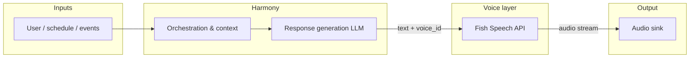

# Fish Speech — Zeiron / Harmony Integration Assessment (Phase 4)

Architecture assessment for using self-hosted Fish Speech as Zeiron’s local voice layer. **No production implementation** in this POC — integration options and tradeoffs only.

## Target flow



**Harmony** (orchestration) gathers context — calendar, Atlas/Bifrost status, study reminders — and produces **natural-language responses**. **Fish Speech** converts the final spoken script to audio. **Audio output** is whatever Zeiron uses: desktop agent, speaker, WebRTC, or cached files.

Separation of concerns:

| Layer | Responsibility |
|-------|----------------|
| Harmony | When to speak, what to say, tone instructions, language choice |
| Response LLM | Wording, entity names, multilingual copy |
| Fish Speech | Timbre, prosody, audio encoding |
| Audio output | Playback, interruption, volume, device routing |

## API integration options

### Option A — Sidecar HTTP (recommended for POC → v1)

Run `fish-speech-api` container on localhost (or Unix socket behind reverse proxy).

| Aspect | Detail |
|--------|--------|
| Endpoint | `POST http://127.0.0.1:8080/v1/tts` (confirm schema in `/docs`) |
| Voice selection | `references/<voice_id>/` pre-registered, or inline base64 reference per request |
| Auth | None on localhost; add API key / mTLS before multi-tenant |
| Payload | `text`, `reference_text`, `reference_audio` or pre-baked reference id |
| Response | WAV/MP3 bytes |

**Zeiron adapter (future):**

```typescript
// Illustrative — not implemented in POC
async function synthesizeZeironSpeech(opts: {
  text: string;
  voiceId: string;
  format?: "wav" | "mp3";
}): Promise<ArrayBuffer> {
  const res = await fetch(`${process.env.FISH_SPEECH_URL}/v1/tts`, {
    method: "POST",
    headers: { "Content-Type": "application/json" },
    body: JSON.stringify({
      text: opts.text,
      reference_id: opts.voiceId,
      format: opts.format ?? "wav",
    }),
  });
  if (!res.ok) throw new Error(`TTS failed: ${res.status}`);
  return res.arrayBuffer();
}
```

### Option B — WebUI-only (human-in-the-loop)

Use Gradio for manual validation; Harmony would not call WebUI in production. Useful for tuning `sample.lab` and emotion markers.

### Option C — Cloud Fish Audio API

Same SDK shape (`fish-audio-sdk`, WebSocket streaming) but **violates “no cloud”** requirement. Keep as fallback reference only.

### Option D — Embedded Python (monolith)

Import `fish_speech` in-process inside Harmony. Lowest network latency, highest coupling and GPU contention with LLM. Not recommended unless Zeiron is a single Python runtime.

## Streaming support

| Mode | Self-hosted (this POC) | Cloud Fish Audio |
|------|------------------------|------------------|
| Chunked HTTP | Depends on server build; check `/docs` | Supported |
| WebSocket | Documented for cloud (`stream_websocket`) | Yes — ~300 ms balanced latency |
| Sentence batching | Harmony sends sentence-sized `text` chunks | Recommended pattern |

**Practical v1 for Zeiron:** Harmony streams **LLM tokens → sentence buffer → TTS request per sentence**. Overlap generation with playback (buffer 2–3 chunks) even without WebSocket.

Self-hosted S1-mini may not expose cloud-equivalent WebSocket; treat streaming as **incremental HTTP** unless verified on your image tag.

## Latency

| Stage | Estimate (S1-mini, 16 GB, COMPILE=1) | Notes |
|-------|--------------------------------------|-------|
| Cold model load | 60–180 s | Once per container |
| First compile | 120–300 s | One-time per process |
| Single sentence TTS | *Measure in POC* | Target < 2 s for assistant feel |
| End-to-end (LLM + TTS) | Dominated by LLM | Parallelize: start TTS on first complete sentence |

For **interactive** Zeiron (wake word, back-and-forth), budget:

- **Acceptable:** < 1 s time-to-first-audio after text finalized
- **Risk:** Running LLM + Fish Speech on same 16 GB GPU — serialize or use CPU LLM

## Multi-language support

Fish Audio documents multilingual generation and phoneme control. For Zeiron’s three languages:

| Language | Self-hosted S1-mini (POC) | Integration note |
|----------|----------------------------|------------------|
| **English** | Primary; emotion markers `(calm)`, `(serious)` | Default reference & phrases |
| **Japanese** | Supported in product line; use **Japanese reference** + Japanese `text` for best accent | Fine-grained: [Japanese phoneme docs](https://docs.fish.audio/developer-guide/core-features/fine-grained-control/japanese.md) |
| **French** | Supported among multilingual set | Pass French script; French reference preferred |

**Cross-lingual cloning** (English reference, Japanese text) often causes accent drift — prefer language-matched references per voice profile, e.g. `references/voice_a-en/`, `references/voice_a-ja/`.

Harmony should pass:

```json
{
  "text": "…",
  "voice_id": "voice_a-ja",
  "language_hint": "ja"
}
```

Exact parameter names depend on OpenAPI for the pinned Docker tag.

## Voice profiles in Zeiron

| Concept | Fish Speech POC mapping |
|---------|-------------------------|
| User voice | `references/<user_id>/` |
| Persona (assistant voice) | `references/voice_a/` |
| Emotion | Inline markers in text from Harmony |
| Caching | Write `output/cache/<hash>.wav` keyed by `text+voice_id` |

## Configuration surface (future)

```env
FISH_SPEECH_URL=http://127.0.0.1:8080
FISH_SPEECH_VOICE_DEFAULT=voice_a
FISH_SPEECH_COMPILE=1
FISH_SPEECH_FORMAT=wav
```

## Security & ops (future, not POC)

- Bind API to `127.0.0.1` only
- No outbound calls from container
- Pin image digest, not `latest`
- Health check: `GET /docs` or dedicated `/health`
- Resource limit: one GPU consumer; queue requests

## Risks

| Risk | Mitigation |
|------|------------|
| VRAM contention with local LLM | Separate GPUs, smaller LLM quant, or sequential pipeline |
| API drift across image tags | Pin version; codegen client from `/docs` |
| Reference transcript wrong | Auto-transcribe in WebUI once, store in gitignored profile |
| S2-Pro needed for quality | Evaluate after S1-mini POC; plan 24 GB or quantized S2 |

## Recommendation (POC conclusion)

1. **Proceed** with Fish Speech **API sidecar** (`docker compose --profile api`) as the voice backend.
2. **Harmony** emits finalized strings + `voice_id`; no audio logic in the LLM.
3. **Validate** latency and Japanese/French with language-matched references before committing beyond POC.
4. **Keep XTTS** container compose file for A/B — lower VRAM, useful fallback.

Next: run listening tests and fill scores in [fish-speech-vs-xtts.md](./fish-speech-vs-xtts.md).
